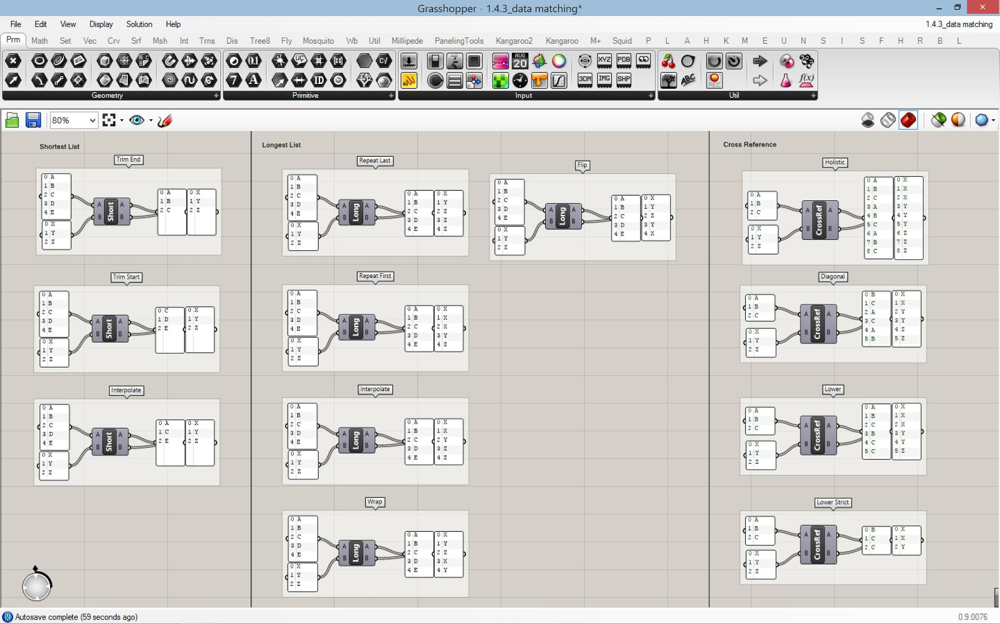

# Combinatorics (WIP)
by [Kyle Phillips](http://haptic-data.com)



Methods to generate combinations of values between two or more arrays. Based off of Grasshoppers Cross-Reference component except it can take more than 2 arguments.


```js
const combinatorics = require('combinatorics');

combinatorics.holistic('ABC'.split(''), 'XYZ'.split(''), [0, 1, 2])

[ [ 'A', 'X', 0 ],
  [ 'B', 'X', 0 ],
  [ 'C', 'X', 0 ],
  [ 'A', 'Y', 0 ],
  [ 'B', 'Y', 0 ],
  [ 'C', 'Y', 0 ],
  [ 'A', 'Z', 0 ],
  [ 'B', 'Z', 0 ],
  [ 'C', 'Z', 0 ],
  [ 'A', 'X', 1 ],
  [ 'B', 'X', 1 ],
  [ 'C', 'X', 1 ],
  [ 'A', 'Y', 1 ],
  [ 'B', 'Y', 1 ],
  [ 'C', 'Y', 1 ],
  [ 'A', 'Z', 1 ],
  [ 'B', 'Z', 1 ],
  [ 'C', 'Z', 1 ],
  [ 'A', 'X', 2 ],
  [ 'B', 'X', 2 ],
  [ 'C', 'X', 2 ],
  [ 'A', 'Y', 2 ],
  [ 'B', 'Y', 2 ],
  [ 'C', 'Y', 2 ],
  [ 'A', 'Z', 2 ],
  [ 'B', 'Z', 2 ],
  [ 'C', 'Z', 2 ] ]
```

## Methods

### Short-list
 * `.trimEnd(...)`
 * `.trimStart(...)`
 * `.interpolateShort(...)`

### long-list
 * `.repeatFirst(...)`
 * `.repeatLast(...)`
 * `.wrap(...)`
 * `.flip(...)`
 * `.holistic(...)`


**MIT LICENSE**